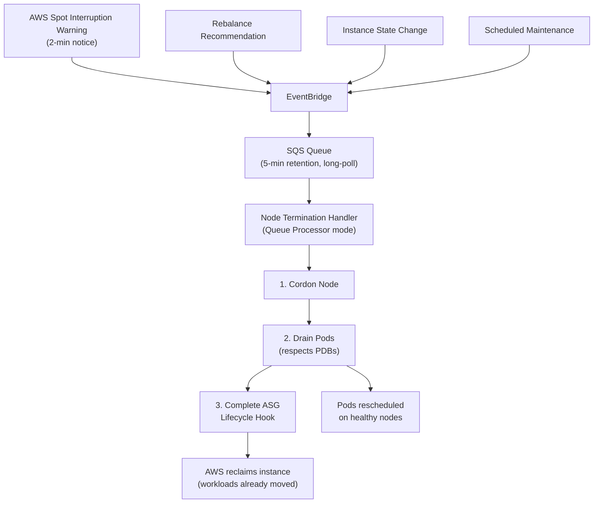

# Spot Instance Graceful Migration — Implementation Summary

## What Was Built

A complete **zero-downtime spot instance migration system** for EKS, inspired by how companies like Zomato run massive stateless workloads on spot to cut infra costs by 60-80%.

## Files Created/Modified

### Terraform (New Files)
| File | Purpose |
|------|---------|
| [spot-termination.tf](file:///home/zoro/Project/retail-cloud-native-platform/terraform/spot-termination.tf) | SQS queue + 4 EventBridge rules + ASG lifecycle hooks |
| [irsa.tf](file:///home/zoro/Project/retail-cloud-native-platform/terraform/irsa.tf) | IAM roles for NTH via IRSA (zero static creds) |
| [node-termination-handler.tf](file:///home/zoro/Project/retail-cloud-native-platform/terraform/node-termination-handler.tf) | NTH Helm release in Queue Processor mode |

### Terraform (Rewritten)
| File | Key Changes |
|------|-------------|
| [main.tf](file:///home/zoro/Project/retail-cloud-native-platform/terraform/main.tf) | System (On-Demand, tainted) + Spot worker node groups, 10 instance types, IMDSv2 |
| [addons.tf](file:///home/zoro/Project/retail-cloud-native-platform/terraform/addons.tf) | Ingress pinned to system nodes, HA replicas, CriticalAddonsOnly toleration |
| [variables.tf](file:///home/zoro/Project/retail-cloud-native-platform/terraform/variables.tf) | Spot config variables, input validation, k8s version fix |
| [outputs.tf](file:///home/zoro/Project/retail-cloud-native-platform/terraform/outputs.tf) | SQS URL/ARN, NTH role ARN, VPC outputs |
| [locals.tf](file:///home/zoro/Project/retail-cloud-native-platform/terraform/locals.tf) | Added account_id local |

### Kubernetes Manifests (New)
| File | Purpose |
|------|---------|
| [deployment-template.yaml](file:///home/zoro/Project/retail-cloud-native-platform/k8s/spot-resilience/deployment-template.yaml) | Reference deployment with PDB, topology spread, graceful shutdown |
| [spot-alerts.yaml](file:///home/zoro/Project/retail-cloud-native-platform/k8s/monitoring/spot-alerts.yaml) | 5 Prometheus alerting rules for spot events |

### Documentation
| File | Purpose |
|------|---------|
| [README.md](file:///home/zoro/Project/retail-cloud-native-platform/terraform/README.md) | Full architecture docs, cost comparison, operational runbooks |

## Architecture Flow



## Validation

```
✅ terraform init      — All providers and modules downloaded
✅ terraform validate   — Configuration is valid
✅ terraform fmt        — All files formatted
```

> [!IMPORTANT]
> Before `terraform apply`, review the plan carefully. The system node group has a `CriticalAddonsOnly` taint — existing addon pods (CoreDNS, etc.) will need matching tolerations, which the EKS module handles automatically for managed addons.
