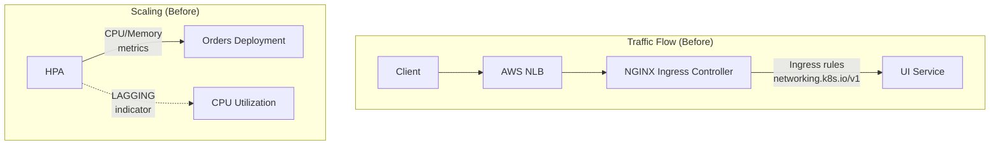
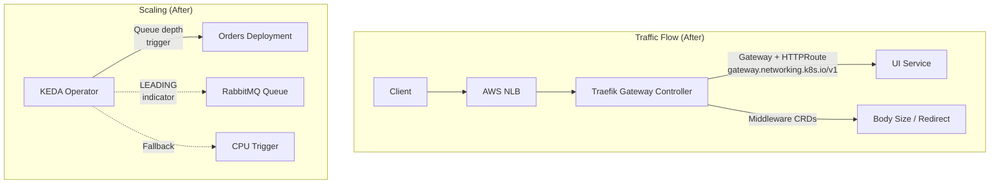
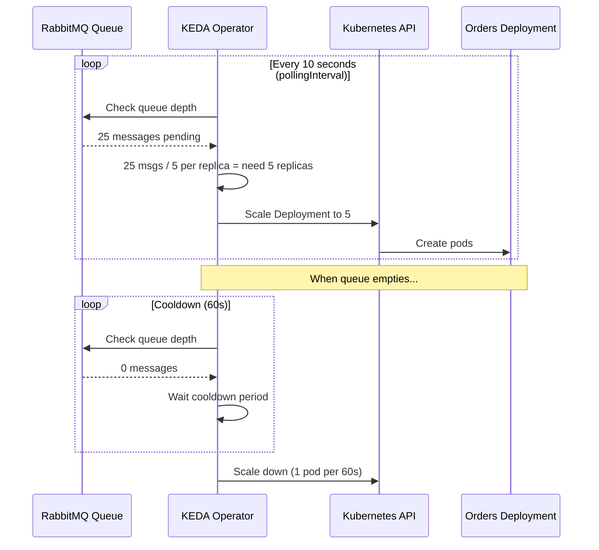

# Migration Guide: NGINX Ingress → Traefik Gateway API + KEDA Autoscaler

> [!IMPORTANT]
> This document covers two major infrastructure migrations performed on the retail-cloud-native-platform:
> 1. **NGINX Ingress Controller → Traefik Gateway API** — routing and traffic management
> 2. **HPA (CPU-based) → KEDA (RabbitMQ queue-driven)** — autoscaling for the Orders service

---

## Table of Contents

1. [Architecture Overview](#1-architecture-overview)
2. [Why These Changes?](#2-why-these-changes)
3. [Workload Placement (Spot vs On-Demand)](#workload-placement-spot-vs-on-demand)
4. [Change 1: NGINX → Traefik Gateway API](#3-change-1-nginx--traefik-gateway-api)
5. [Change 2: HPA → KEDA Autoscaler](#4-change-2-hpa--keda-autoscaler)
6. [Files Changed Summary](#5-files-changed-summary)
7. [Deployment Procedure](#6-deployment-procedure)
8. [Rollback Plan](#7-rollback-plan)
9. [Validation & Testing](#9-validation--testing)

---

## 1. Architecture Overview

### Before (NGINX Ingress + HPA)



### After (Traefik Gateway API + KEDA)



---

## 2. Why These Changes?

### Why Traefik Gateway API over NGINX Ingress?

| Aspect | NGINX Ingress | Traefik Gateway API |
|--------|--------------|-------------------|
| **API Version** | `networking.k8s.io/v1` (Ingress) | `gateway.networking.k8s.io/v1` (GA) |
| **Configuration** | Annotation sprawl (`nginx.ingress.kubernetes.io/*`) | Declarative CRDs (Middleware, HTTPRoute) |
| **Role Separation** | Flat — one resource does everything | Infra team → Gateway, App team → HTTPRoute |
| **Portability** | Vendor-locked to NGINX annotations | Switch to Envoy/HAProxy without route changes |
| **Timeouts** | Via annotations | Native `timeouts.request` in HTTPRoute |
| **Body Size** | `proxy-body-size` annotation | Middleware CRD (`buffering.maxRequestBodyBytes`) |
| **TLS** | Inline in Ingress spec | Gateway listener with cert-manager integration |
| **Kubernetes Status** | Legacy (maintenance mode) | GA since K8s 1.27 — the official successor |

### Why KEDA over HPA for RabbitMQ?

| Aspect | HPA | KEDA |
|--------|-----|------|
| **Scaling Signal** | CPU/Memory (LAGGING) | Queue Depth (LEADING) |
| **Reaction Time** | Scales AFTER pods are overloaded | Scales BEFORE overload hits |
| **Scale to Zero** | ❌ Minimum 1 replica always | ✅ Zero replicas when idle |
| **Custom Metrics** | Requires metrics-server + adapter | Native RabbitMQ scaler built-in |
| **Cooldown Control** | Basic `behavior` stanza | Rich `cooldownPeriod` + `pollingInterval` |
| **Cost on Spot** | Runs idle pods during low traffic | Zero replicas = zero spot cost |
| **Protocol** | HTTP metrics API | AMQP native (understands RabbitMQ) |

> [!TIP]
> KEDA is especially powerful for the Orders service because order processing is inherently **bursty** — flash sales, end-of-day batches, etc. Queue depth tells you *how much work is waiting*, while CPU tells you *how stressed the current pods are* (which is too late).

---

## Workload Placement (Spot vs On-Demand)

A common point of confusion is whether these new infrastructure components run on Spot or On-Demand. To ensure high availability, we follow a strict separation:

### 🛡️ **On-Demand (System Nodes)**
*These must NEVER be interrupted.*
- **Traefik Gateway Controller**: Responsible for all ingress traffic. If this restarts due to a spot reclaim, the entire site goes down temporarily.
- **KEDA Operator**: Responsible for scaling the Orders service. If this restarts, the Orders service cannot scale during a traffic surge.
- **RabbitMQ**: The source of truth for KEDA metrics. State must be preserved.

### 🚀 **Spot Instances (Worker Nodes)**
*These are optimized for cost.*
- **Orders Service**: The application *scaled* by KEDA. Since it is stateless, it is perfectly safe to run on Spot. If one replica is reclaimed, KEDA (running on On-Demand) will immediately detect the queue depth and provision a replacement.
- **UI/Cart/Catalog**: All other stateless frontend and API services.

---

## 3. Change 1: NGINX → Traefik Gateway API

### 3.1 Concept Mapping

Every NGINX Ingress concept has a Gateway API equivalent:

```
┌─────────────────────────┐    ┌──────────────────────────────┐
│    NGINX INGRESS        │    │    TRAEFIK GATEWAY API        │
├─────────────────────────┤    ├──────────────────────────────┤
│ Ingress resource        │ →  │ Gateway + HTTPRoute           │
│ ingress.className       │ →  │ gatewayClassName              │
│ ingress.rules[].host    │ →  │ HTTPRoute.spec.hostnames      │
│ ingress.rules[].paths   │ →  │ HTTPRoute.spec.rules.matches  │
│ ingress.tls             │ →  │ Gateway.spec.listeners[].tls  │
│ proxy-body-size annot   │ →  │ Middleware CRD (buffering)    │
│ ssl-redirect annot      │ →  │ Middleware CRD (redirectScheme│
│ proxy-*-timeout annots  │ →  │ HTTPRoute.spec.rules.timeouts │
│ cert-manager/issuer     │ →  │ Gateway annotation + solver   │
└─────────────────────────┘    └──────────────────────────────┘
```

### 3.2 Files Created

| File | Purpose |
|------|---------|
| [gateway.yaml](file:///home/zoro/Project/retail-cloud-native-platform/src/ui/chart/templates/gateway.yaml) | Gateway resource with HTTP + HTTPS listeners |
| [httproute.yaml](file:///home/zoro/Project/retail-cloud-native-platform/src/ui/chart/templates/httproute.yaml) | HTTPRoute rules + Traefik middleware CRDs |
| [values-traefik-gateway.yaml](file:///home/zoro/Project/retail-cloud-native-platform/src/ui/chart/values-traefik-gateway.yaml) | Drop-in replacement for `values-nginx-ingress.yaml` |

### 3.3 Files Modified

| File | Change |
|------|--------|
| [values.yaml](file:///home/zoro/Project/retail-cloud-native-platform/src/ui/chart/values.yaml) | Disabled NGINX ingress, added `gatewayAPI` config block |
| [cluster-issuer.yaml](file:///home/zoro/Project/retail-cloud-native-platform/src/ui/chart/templates/cert-manager/cluster-issuer.yaml) | Updated ACME solver to use Gateway API HTTP-01 |
| [addons.tf](file:///home/zoro/Project/retail-cloud-native-platform/terraform/addons.tf) | Disabled nginx, added Traefik helm_release |

### 3.4 Key Design Decisions

**Gateway + HTTPRoute split**: The Gateway defines infrastructure-level concerns (listeners, TLS, ports) while HTTPRoute defines application-level routing (paths, backends, timeouts). This matches the Kubernetes Gateway API's role-oriented model.

**Middleware CRDs**: Instead of NGINX annotations like `nginx.ingress.kubernetes.io/proxy-body-size: "8m"`, we use Traefik's `Middleware` CRD:

```diff
- # NGINX annotation approach
- annotations:
-   nginx.ingress.kubernetes.io/proxy-body-size: "8m"
-   nginx.ingress.kubernetes.io/proxy-read-timeout: "600"
-   nginx.ingress.kubernetes.io/ssl-redirect: "true"

+ # Traefik CRD approach
+ apiVersion: traefik.io/v1alpha1
+ kind: Middleware
+ metadata:
+   name: ui-body-size
+ spec:
+   buffering:
+     maxRequestBodyBytes: 8388608
```

**Cert-manager solver**: Updated from Ingress-class solver to Gateway API solver:

```diff
  solvers:
- - http01:
-     ingress:
-       class: nginx
+ - http01:
+     gatewayHTTPRoute:
+       parentRefs:
+         - name: ui-gateway
+           kind: Gateway
```

---

## 4. Change 2: HPA → KEDA Autoscaler

### 4.1 How KEDA Works (vs HPA)



### 4.2 Files Created

| File | Purpose |
|------|---------|
| [keda-scaledobject.yaml](file:///home/zoro/Project/retail-cloud-native-platform/src/orders/chart/templates/keda-scaledobject.yaml) | KEDA ScaledObject with RabbitMQ trigger + CPU fallback |
| [keda-trigger-auth.yaml](file:///home/zoro/Project/retail-cloud-native-platform/src/orders/chart/templates/keda-trigger-auth.yaml) | TriggerAuthentication for RabbitMQ credentials |

### 4.3 Files Modified

| File | Change |
|------|--------|
| [orders/values.yaml](file:///home/zoro/Project/retail-cloud-native-platform/src/orders/chart/values.yaml) | Disabled HPA, added full `keda` config block |
| [orders/deployment.yaml](file:///home/zoro/Project/retail-cloud-native-platform/src/orders/chart/templates/deployment.yaml) | Updated replica guard to respect KEDA |
| [addons.tf](file:///home/zoro/Project/retail-cloud-native-platform/terraform/addons.tf) | Added KEDA Helm release |

### 4.4 KEDA Configuration Explained

```yaml
keda:
  enabled: true
  minReplicaCount: 2        # Never go below 2 (matches PDB)
  maxReplicaCount: 15       # Cap at 15 during extreme surges
  cooldownPeriod: 60        # Wait 60s before scaling down
  pollingInterval: 10       # Check queue every 10s
  
  rabbitmq:
    queueName: "orders"     # Monitor the "orders" queue
    queueLength: "5"        # Scale when >5 msgs per replica
    mode: "QueueLength"     # Scale based on pending messages
  
  # Scaling behavior
  scaleUp:
    maxPodsPerInterval: 3   # Add max 3 pods per 30s (aggressive)
  scaleDown:
    maxPodsPerInterval: 1   # Remove max 1 pod per 60s (conservative)
  
  # Safety net
  fallbackCPUTrigger:
    enabled: true           # If RabbitMQ metrics fail, fall back to CPU
    targetUtilization: "70"
```

> [!WARNING]
> The `minReplicaCount: 2` is intentionally set to match the PDB's `minAvailable: 2`. If you enable scale-to-zero (`idleReplicaCount: 0`), be aware that cold starts will add latency to the first order after an idle period.

### 4.5 Deployment Guard

The Orders Deployment template was updated so that **neither HPA nor KEDA conflict with the static replica count**:

```diff
- {{- if not .Values.autoscaling.enabled }}
+ {{- if not (or .Values.autoscaling.enabled .Values.keda.enabled) }}
    replicas: {{ .Values.replicaCount }}
  {{- end }}
```

When KEDA is enabled, it creates its own HPA under the hood and manages the replica count through the ScaledObject.

---

## 5. Files Changed Summary

### New Files (4)

| File | Layer | Purpose |
|------|-------|---------|
| `src/ui/chart/templates/gateway.yaml` | Helm | Traefik Gateway resource |
| `src/ui/chart/templates/httproute.yaml` | Helm | HTTPRoute + Middleware CRDs |
| `src/orders/chart/templates/keda-scaledobject.yaml` | Helm | KEDA ScaledObject for RabbitMQ |
| `src/orders/chart/templates/keda-trigger-auth.yaml` | Helm | KEDA TriggerAuthentication |
| `src/ui/chart/values-traefik-gateway.yaml` | Values | Traefik values override (replaces nginx one) |

### Modified Files (5)

| File | What Changed |
|------|-------------|
| `src/ui/chart/values.yaml` | NGINX ingress disabled, `gatewayAPI` block added |
| `src/ui/chart/templates/cert-manager/cluster-issuer.yaml` | Solver switched to Gateway API |
| `src/orders/chart/values.yaml` | HPA disabled, `keda` block added |
| `src/orders/chart/templates/deployment.yaml` | Replica guard updated for KEDA |
| `terraform/addons.tf` | NGINX disabled, Traefik + KEDA helm releases added |

### Unchanged Files (kept as-is)

| File | Why Unchanged |
|------|--------------|
| `src/ui/chart/templates/ingress.yaml` | Kept for rollback — disabled via `ingress.enabled: false` |
| `src/ui/chart/values-nginx-ingress.yaml` | Kept for rollback reference |
| `src/ui/chart/templates/istio-gateway.yml` | Separate concern — Istio is independently disabled |
| `src/*/chart/templates/hpa.yaml` (all services) | Kept for rollback — disabled via `autoscaling.enabled: false` |

---

## 6. Deployment Procedure

### Prerequisites

```bash
# 1. Ensure Gateway API CRDs are installed (required for Traefik)
kubectl apply -f https://github.com/kubernetes-sigs/gateway-api/releases/download/v1.1.0/standard-install.yaml

# 2. Verify CRDs
kubectl get crd gateways.gateway.networking.k8s.io
kubectl get crd httproutes.gateway.networking.k8s.io
```

### Step-by-Step Deployment

```bash
# Step 1: Apply Terraform (installs Traefik + KEDA, disables NGINX)
cd terraform
terraform plan -out=migration.plan
terraform apply migration.plan

# Step 2: Verify Traefik is running
kubectl get pods -n traefik-system
kubectl get svc -n traefik-system

# Step 3: Verify KEDA is running
kubectl get pods -n keda
kubectl get crd scaledobjects.keda.sh

# Step 4: Deploy UI chart (creates Gateway + HTTPRoute)
helm upgrade --install retail-store-ui src/ui/chart -n retail-store

# Step 5: Deploy Orders chart (creates KEDA ScaledObject)
helm upgrade --install retail-store-orders src/orders/chart -n retail-store

# Step 6: Verify Gateway API resources
kubectl get gateway -n retail-store
kubectl get httproute -n retail-store
kubectl get middleware.traefik.io -n retail-store

# Step 7: Verify KEDA ScaledObject
kubectl get scaledobject -n retail-store
kubectl get hpa -n retail-store   # KEDA creates an HPA internally
```

---

## 7. Rollback Plan

### Rollback to NGINX Ingress

```yaml
# In src/ui/chart/values.yaml:
ingress:
  enabled: true              # ← Re-enable
  className: "nginx"
gatewayAPI:
  enabled: false             # ← Disable
```

```bash
# In Terraform:
# Set enable_ingress_nginx = true in eks_addons module
# Remove/comment the helm_release.traefik resource
terraform apply
```

### Rollback to HPA

```yaml
# In src/orders/chart/values.yaml:
autoscaling:
  enabled: true              # ← Re-enable
keda:
  enabled: false             # ← Disable
```

> [!NOTE]
> All original NGINX Ingress and HPA templates were **deliberately preserved** in the chart templates directory. They are gated by `if .Values.ingress.enabled` and `if .Values.autoscaling.enabled` conditions, so they render as empty files when disabled. Re-enabling is a single values toggle.

---

## 8. Validation & Testing

### Gateway API Validation

```bash
# Check Gateway is accepted by Traefik
kubectl get gateway -n retail-store -o jsonpath='{.items[0].status.conditions[*].type}'
# Expected: Accepted, Programmed

# Check HTTPRoute is bound
kubectl get httproute -n retail-store -o jsonpath='{.items[0].status.parents[*].conditions[*].type}'
# Expected: Accepted, ResolvedRefs

# Test traffic flow
curl -v http://$(kubectl get svc traefik -n traefik-system -o jsonpath='{.status.loadBalancer.ingress[0].hostname}')
```

### KEDA Validation

```bash
# Check ScaledObject is ready
kubectl get scaledobject -n retail-store
# STATUS should show "Ready" and "Active"

# Simulate load — publish messages to RabbitMQ
kubectl exec -n retail-store deploy/retail-store-orders-rabbitmq -- \
  rabbitmqadmin publish routing_key=orders payload='{"test":"order"}' -r 20

# Watch scaling happen
kubectl get hpa -n retail-store -w
# Should see TARGETS increase, then REPLICAS scale up

# Verify scale-down after cooldown
kubectl get pods -n retail-store -l app.kubernetes.io/component=service -w
```

### Monitoring Integration

Both Traefik and KEDA expose Prometheus metrics. The existing monitoring stack will auto-discover them via pod annotations:

```bash
# Traefik metrics
curl http://traefik-pod:9100/metrics | grep traefik_entrypoint_requests_total

# KEDA metrics
curl http://keda-pod:8080/metrics | grep keda_scaler_metrics_value
```
