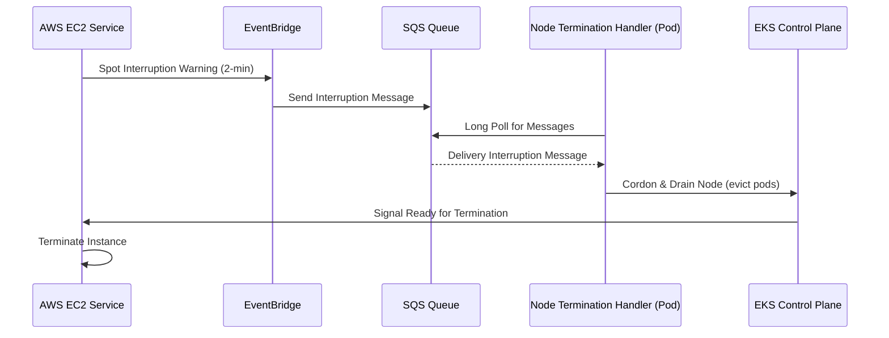

# 🏗️ Infrastructure Architecture: Cloud Native Retail Platform

This document describes the production-grade AWS EKS architecture designed for high availability, cost efficiency (Spot Instances), and automated operations (GitOps).

---

## 🌐 Network Topology
The foundation is a **Multi-AZ VPC** across 3 Availability Zones to ensure regional resilience.
- **Public Subnets:** Host the AWS Network Load Balancer (NLB) and NAT Gateways.
- **Private Subnets:** Host the EKS Worker Nodes and the Control Plane (private endpoint). All traffic to the internet from here is routed via NAT Gateways.
- **Security:** Standard EKS Security Groups are applied, with specific rules for Traefik Ingress (80/443) and NodePort access.

---

## ⚡ Compute Strategy (The "Split" Node Strategy)
To maximize stability while minimizing costs, the cluster uses two distinct Node Groups:

### 1. System Node Group (On-Demand)
- **Role:** Management and Critical Add-ons.
- **Instances:** On-Demand `t3.medium`.
- **Logic:** Tainted with `CriticalAddonsOnly=true:NoSchedule`. This prevents general application workloads from landing here.
- **Add-ons:** Traefik, Prometheus, ArgoCD, and the Node Termination Handler.

### 2. App Worker Node Group (Spot)
- **Role:** Stateless Retail Microservices.
- **Instances:** Spot `t3/t3a/m5/m5a` (Mixed types).
- **Logic:** Uses **Spot Instance Diversification** across multiple types and families. This drastically reduces the probability of a "mass interruption" event.

---

## 🛡️ Spot Resilience Flow (Automated Draining)
The most critical part of this architecture is the automated handling of Spot Instance interruptions.

- **EventBridge Rules:** Capture 2-minute warnings, rebalance recommendations, and ASG lifecycle hooks.
- **Node Termination Handler (NTH):** A pod running in `Queue Processor` mode that watches SQS and proactively drains nodes before AWS kills the underlying instance.

---

## 🚀 Traffic Flow (Gateway API)
We use **Traefik** as the modern implementation of the **Kubernetes Gateway API**.
1. **NLB:** Terminating external traffic and forwarding to the cluster.
2. **Traefik Gateway:** Running on System nodes, it auto-discovers `HTTPRoute` resources.
3. **Routing:** Path-based routing redirects traffic to the specific microservices (Catalog, Cart, Order, etc.) running on Spot workers.

---

## 📦 GitOps & Monitoring
- **GitOps (ArgoCD):** All Kubernetes manifests are stored in a Git repository. ArgoCD syncs these manifests to the cluster, ensuring that the actual state matches the desired state.
- **Monitoring (Prometheus & Grafana):** Lightweight monitoring stack that scrapes metrics from the cluster and visualizes them in Grafana dashboards, providing real-time visibility into Spot node performance and application health.
