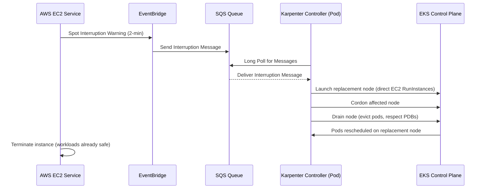

# 🏗️ Infrastructure Architecture: Cloud Native Retail Platform

This document describes the production-grade AWS EKS architecture designed for high availability, cost efficiency (Spot Instances via Karpenter), and automated operations (GitOps).

---

## 🌐 Network Topology

The foundation is a **Multi-AZ VPC** across 3 Availability Zones to ensure regional resilience.

```
┌──────────────────────────────────────────────────────────────────────────┐
│                         VPC (10.0.0.0/16)                                │
│                                                                          │
│  ┌─────────────────┐   ┌─────────────────┐  ┌─────────────────┐          │
│  │  Public Subnet   │  │  Public Subnet  │  │  Public Subnet  │          │
│  │  AZ-a            │  │  AZ-b           │  │  AZ-c           │          │
│  │  [NLB] [NAT GW]  │  │  [NLB] [NAT GW] │  │  [NLB] [NAT GW] │          │
│  └────────┬─────────┘  └────────┬────────┘  └────────┬────────┘          │
│           │                     │                     │                  │
│  ┌────────▼─────────┐   ┌────────▼─────────┐  ┌────────▼─────────┐       │
│  │  Private Subnet  │   │  Private Subnet  │  │  Private Subnet  │       │
│  │  AZ-a            │   │  AZ-b            │  │  AZ-c            │       │
│  │ [System Nodes]   │   │  [System Nodes]  │  │  [System Nodes]  │       │
│  │ [Karpenter Nodes]│   │ [Karpenter Nodes]│  │ [Karpenter Nodes]│       │
│  └──────────────────┘   └──────────────────┘  └──────────────────┘       │
└──────────────────────────────────────────────────────────────────────────┘
```

- **Public Subnets:** Host the AWS Network Load Balancer (NLB) and NAT Gateways.
- **Private Subnets:** Host the EKS Worker Nodes and the Control Plane (private endpoint). All outbound traffic is routed via NAT Gateways.
- **Security:** Standard EKS Security Groups are applied, with specific rules for Traefik Ingress (80/443) and NodePort access.

---

## ⚡ Compute Strategy

To maximize stability while minimizing costs, the cluster uses two compute strategies:

### 1. System Node Group (EKS Managed — On-Demand)
- **Role:** Management and Critical Add-ons.
- **Instances:** On-Demand `t3.medium` (2 nodes min, 4 max).
- **Logic:** Tainted with `CriticalAddonsOnly=true:NoSchedule`. Only cluster-critical pods land here.
- **Workloads:** Karpenter Controller, Traefik, Prometheus/Grafana, ArgoCD, KEDA, CoreDNS, Cert-Manager.
- **Why On-Demand:** These must NEVER be interrupted. If Karpenter runs on a spot node, it could be killed and the cluster loses its ability to provision replacement capacity.

### 2. Karpenter-Provisioned Nodes (Dynamic — Spot-Preferred)
- **Role:** Stateless Retail Microservices.
- **Instance Families:** m5, m5a, m5d, m6i, m6a, m4, r5, r6i, c5, c6i (50+ size combinations).
- **Capacity Type:** Spot preferred (weight 80), On-Demand fallback (weight 20).
- **Logic:** Karpenter evaluates ALL instance type combinations, checks current spot pricing across AZs, and picks the cheapest available instance that fits pending pod requirements.
- **Consolidation:** Actively replaces underutilized nodes with smaller/fewer ones every 30s.
- **Disruption Budget:** Max 20% of nodes disrupted simultaneously, zero-disruption window 02:00–04:00 UTC.
- **Resource Limits:** 1000 vCPU, 4000Gi memory max across all Karpenter-managed nodes.

---

## 🛡️ Spot Resilience Flow (Automated Handling via Karpenter)

The most critical part of this architecture is the automated handling of Spot Instance interruptions.



- **EventBridge Rules:** Capture 4 event types — spot interruption warnings, rebalance recommendations, instance state changes, and scheduled maintenance.
- **SQS Queue:** Single queue with long polling. Originally built for NTH, now consumed by Karpenter.
- **Karpenter:** Unlike NTH, Karpenter doesn't just drain — it proactively provisions replacement capacity BEFORE the drain completes, eliminating the ASG warmup delay.

---

## 🚀 Traffic Flow (Gateway API)

We use **Traefik** as the modern implementation of the **Kubernetes Gateway API**.

```
Internet → NLB (public subnet) → Traefik Gateway (system node)
                                       │
                                       ├─ / → UI Service (Karpenter spot nodes)
                                       ├─ /catalog → Catalog API
                                       ├─ /cart → Cart API
                                       ├─ /checkout → Checkout API
                                       └─ /orders → Orders API
```

1. **NLB:** Terminates external traffic and forwards to the cluster.
2. **Traefik Gateway:** Running on System nodes (On-Demand), it auto-discovers `HTTPRoute` resources.
3. **Routing:** Path-based routing redirects traffic to the specific microservices running on Karpenter-provisioned spot nodes.

---

## 📦 GitOps & Monitoring

- **GitOps (ArgoCD):** All Kubernetes manifests are stored in a Git repository. ArgoCD syncs these manifests to the cluster, ensuring that the actual state matches the desired state.
- **Monitoring (Prometheus & Grafana):** Lightweight monitoring stack that scrapes metrics from the cluster including Karpenter controller metrics (node provisioning latency, spot interruption counts, consolidation events).
- **KEDA:** Event-driven autoscaling for the Orders service based on RabbitMQ queue depth. Scales on leading indicators (queue depth) not lagging indicators (CPU).

---

## 📁 Terraform File Map

| File | Purpose |
|------|---------|
| `main.tf` | VPC, EKS cluster, system + spot_workers node groups |
| `karpenter.tf` | Karpenter IRSA, IAM policy, Helm release |
| `karpenter-nodeclass.yaml` | EC2NodeClass (subnets, SGs, AMI, IMDSv2) |
| `karpenter-nodepool.yaml` | NodePool (instance types, limits, disruption policy) |
| `spot-termination.tf` | EventBridge → SQS pipeline (shared with Karpenter) |
| `addons.tf` | Cert-Manager, Prometheus, Traefik, KEDA |
| `argocd.tf` | ArgoCD Helm release |
| `irsa.tf` | (NTH IRSA removed — replaced by Karpenter IRSA in karpenter.tf) |
| `security.tf` | Security group rules for HTTP/HTTPS/NodePort |
| `locals.tf` | Common tags, network calculations |
| `variables.tf` | Input variables |
| `outputs.tf` | Cluster endpoint, SQS URL, Karpenter role ARN |
| `versions.tf` | Provider versions and configurations |
